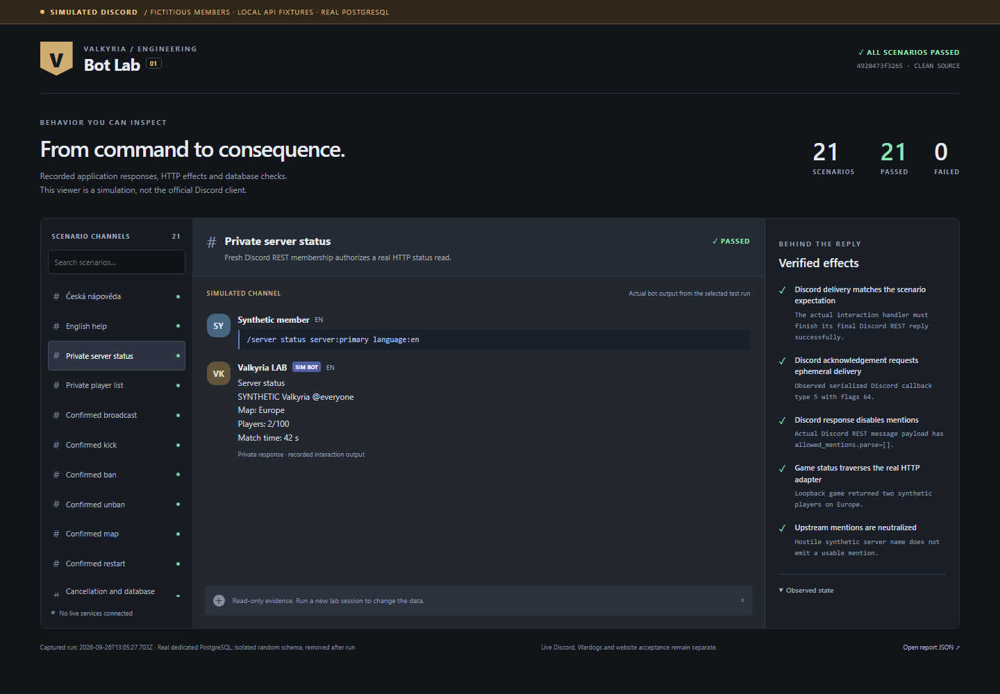
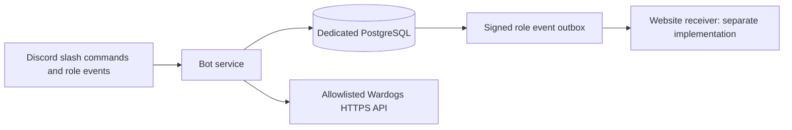

# Valkyria Discord bot

Discord operations service for the Valkyria Wardogs clan. English slash command names,
Czech descriptions and replies by default, with explicit English response selection.
The website is maintained separately in [ValkyriaWDG/www](https://github.com/ValkyriaWDG/www).

The service includes a reproducible Discord simulation lab: production command
handlers, real PostgreSQL, local HTTP fixtures and a browser evidence viewer.
Start with the [documentation index](docs/index.md) or [member and administrator guide](docs/user-guide.md).
Bot provisioning, credentials and live Discord/game-server acceptance remain
separate gates; see [STATUS.md](STATUS.md) and [live acceptance](docs/live-acceptance.md).

## Implemented behavior

- `/help` and `/account`: command help, fresh membership and configured capabilities.
- `/server status` and `/server players`: private, role-authorized server information.
- `/admin broadcast`, `kick`, `ban`, `unban`, `map`, `restart`: saved 60-second
  confirmations, fresh authorization, atomic claims and durable audit. Restart means
  **restart the match**, not the host process. Game writes start disabled.
- Discord role observations and departures produce a transactional, signed outbox for
  the website. Delivery starts disabled. The [proposed receiver contract](docs/web-integration.md)
  must be implemented and verified with the website before enabling it.
- PostgreSQL migrations, process lease, safe unknown outcomes, health endpoints,
  container/CI definitions and repository-native agent workflows.

The website owns Discord OAuth, sessions, administrator login and website RBAC. This
service does not mint website sessions or grant permissions from an unverified event.
No generic server console command or arbitrary host-control endpoint is exposed.

## Local verification without tokens

Use Node 24 (`.node-version`) and the exact pnpm version in `package.json`.

```sh
pnpm install --frozen-lockfile
pnpm lint
pnpm format:check
pnpm typecheck
pnpm test
pnpm build
pnpm check:repository
pnpm check:commits
pnpm demo
node dist/main.js --offline
```

The demo prints a **synthetic** command transcript: help, status, confirmation,
single dispatch, duplicate rejection and role revocation. It never contacts Discord
or a game server. Offline health returns `/health/live` 200 and `/health/ready` 503;
this deliberately does not claim live readiness.

Copy `config/bot.example.json` to ignored `config/bot.json`, then run
`pnpm commands:register` for an offline command manifest. No token is required.
Actual registration is a separate, explicitly targeted operation in the
[operations guide](docs/operations.md).

For database tests, set `TEST_DATABASE_URL` to a **disposable dedicated PostgreSQL
database**, then run `pnpm test:integration`. Tests clear fixture tables; this command
fails if its database configuration is missing. The unit suite does not include DB tests.

## Run the simulated Discord lab

The lab uses fictional members and servers; it does not require or use a Discord
token. Follow the [database setup](docs/lab-database.md) for a disposable PostgreSQL
fixture and set `LAB_DATABASE_URL` as shown there. Then:

```sh
pnpm exec playwright install chromium
pnpm test:e2e
pnpm lab:run
pnpm test:visual
pnpm lab:serve
```

Open `http://127.0.0.1:4178`. The read-only viewer displays actual serialized command
responses beside database and HTTP assertions. Scenarios cover all six administrative
operations, Czech/English help, lost permissions, duplicate/expired confirmations,
unknown outcomes, Discord delivery failures, durable audit and signed role delivery.
The [lab guide](docs/testing-lab.md) explains scope, screenshots and regeneration.
Generated reports and browser captures stay in `.local/lab`; the
[screenshot gallery](docs/evidence/README.md) contains reviewed, dated evidence with
source revisions, captions and SHA-256 hashes.



## Architecture and delivery



| Area                       | Entry point                                                                          |
| -------------------------- | ------------------------------------------------------------------------------------ |
| Architecture and scope     | [Design](docs/design.md), [implementation plan](docs/implementation-plan.md)         |
| Discord and game API       | [Commands](docs/commands.md), [Wardogs wire evidence](docs/wardogs-api.md)           |
| Auth integration           | [Website contract](docs/web-integration.md)                                          |
| Operations and future work | [Runbook](docs/operations.md), [roadmap](docs/roadmap.md)                            |
| Agent delivery             | [AGENTS.md](AGENTS.md), [CLAUDE.md](CLAUDE.md), [skills](docs/engineering/skills.md) |
| Review and proof           | [Contributing](CONTRIBUTING.md), [evidence policy](docs/engineering/evidence.md)     |

CI checks source, unit and real PostgreSQL behavior, builds and smoke-tests the
container, and runs the full simulated Discord pipeline with Chromium captures.
All three jobs must pass the required Quality gate. Image publication is a separate,
initially disabled workflow: a reviewed
main SHA, successful CI, protected environment and configured private registry are
required. It does not deploy. See [release workflow](docs/engineering/release.md).

Only example configuration belongs in Git. Runtime `.env` and `config/bot.json` are
ignored; `.env` is not loaded automatically by the application. Export environment
variables or use Node's `--env-file` option as documented in the runbook.

No open-source license grant has been selected for this repository yet. Public source
availability does not grant a license to Valkyria branding or third-party game assets.
No game assets or private parent-workspace configuration are included.
