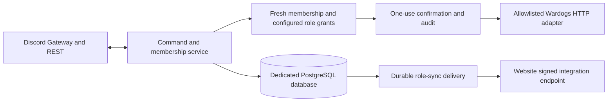

# Discord operations service

Status: implementation design. Owner authorizes architecture and implementation;
application credentials, bot installation and live guild/game tests follow separately.
Code, documentation and AI/GitHub prose are English. Commands keep English names;
Discord descriptions and replies default to Czech, with English localization.

## Decision and boundaries

Build one Node 24 / TypeScript service with discord.js, PostgreSQL and an explicit
Wardogs HTTP client. Reuse the website's TypeScript ecosystem without coupling its
database or runtime. A Python bot is viable but duplicates contracts/tooling; a bot
inside the web process makes Discord reconnects and server-control permissions part
of web deployment. The independent service keeps these responsibilities isolated.

The website owns Discord OAuth, user sessions and website capability mappings. The
bot owns guild event observation, authoritative REST membership reconciliation and
authenticated role snapshots. It never manufactures login sessions or website admin
grants. The sibling website is actively being developed elsewhere: do not edit it.

## First implemented scope

- Guild-only `/help`, `/account`, `/server status`, `/server players`.
- Explicitly scoped `/admin` operations for broadcast, kick, ban, unban, map and
  match restart, limited to endpoints verified in the official console source.
- English command/option names; Czech descriptions/replies and English descriptions
  where supported. Ephemeral replies and disabled mentions by default.
- All private/control operations require a fresh Discord member REST lookup and
  configured role IDs for that capability and server. Discord Administrator and
  role names are not implicit grants. Guild and configured server IDs are allowlisted.
- Every write needs enabled operator configuration, a short-lived confirmation bound
  to actor/guild/server/action, reauthorization at confirmation and an atomic database
  claim. No generic console command or operator-supplied request URL from Discord.
- Persist action state and audit before dispatch; never automatically retry mutations.
  A crash/transport failure after dispatch is an unknown outcome requiring operator
  reconciliation. Audit failures prevent dispatch. Expired/replayed/cross-actor buttons
  cannot execute. Durable interaction uniqueness prevents duplicate initial requests.
- Durable signed bot-to-web role snapshots, departures and periodic reconciliation of
  tracked users. Honor rate limits; timeout/403 is unknown, never fabricated departure.
- Separate liveness/readiness, graceful shutdown, explicit migration and command
  registration CLIs, offline demonstration and container packaging.

Match signups/reminders, public status boards, moderation workflows and statistics
are subsequent scoped issues. Do not invent a Wardogs telemetry API or score rules.

## Configuration and storage

One configured guild and multiple named game servers. Load non-secret settings from
an operator JSON file and secrets through environment references; commit only an
example. Secrets, tokens, raw config, interaction tokens and private player payloads
never enter logs, audit or public artifacts. Use a dedicated database/role and reviewed
SQL migrations. Store durable intents, append-only audit events, membership snapshots,
monotonic sequence and an outbox with bounded retry/backoff. No shared web DB access.

Outbound URLs are operator configured and validated: HTTPS normally, explicit
loopback-only HTTP for local tests, no redirects forwarding credentials. Never accept
URLs from Discord. Bound timeouts, payload size and concurrency. Retry reads only
when their policy explicitly allows it; return safe Czech/English errors.

## Evidence and release

Use test-first implementation for behavior. Run real transport tests against local
HTTP fixtures, authorization/confirmation state-machine tests, signed-message tests
and PostgreSQL integration tests. CI provisions an isolated PostgreSQL service and
builds/runs the non-root container in offline mode. No bot token or game secret is
needed for those checks. Offline output is synthetic evidence, not live Discord proof.

Use scoped branches, PRs, current-head quality checks and proof on issues before
closure. Screenshots of live Discord belong to the deferred custom-guild acceptance;
local transcripts/test reports prove only their named boundaries. CI must not claim
live acceptance. Container publication is separately gated and disabled initially.
No production changes, Discord registration/messages or bot creation in this task.
