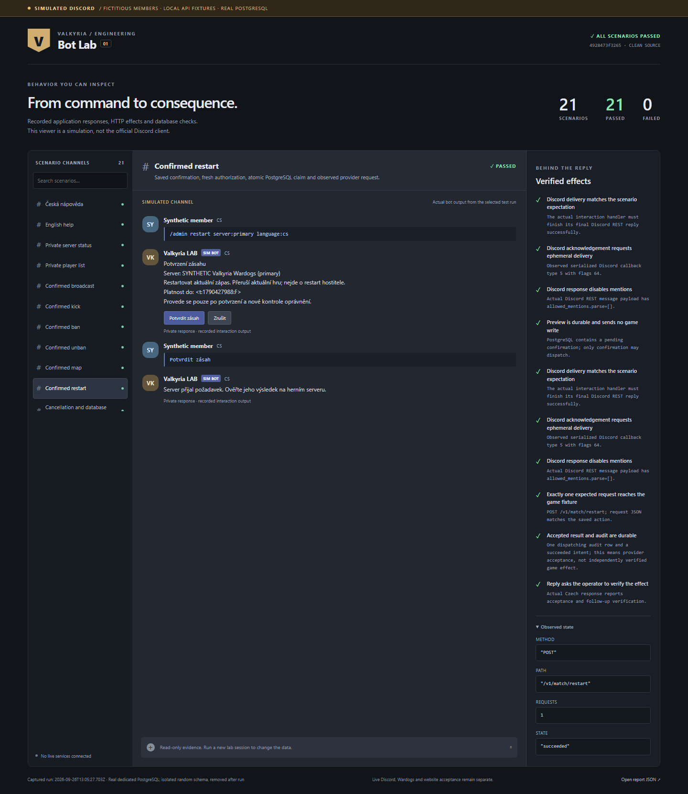
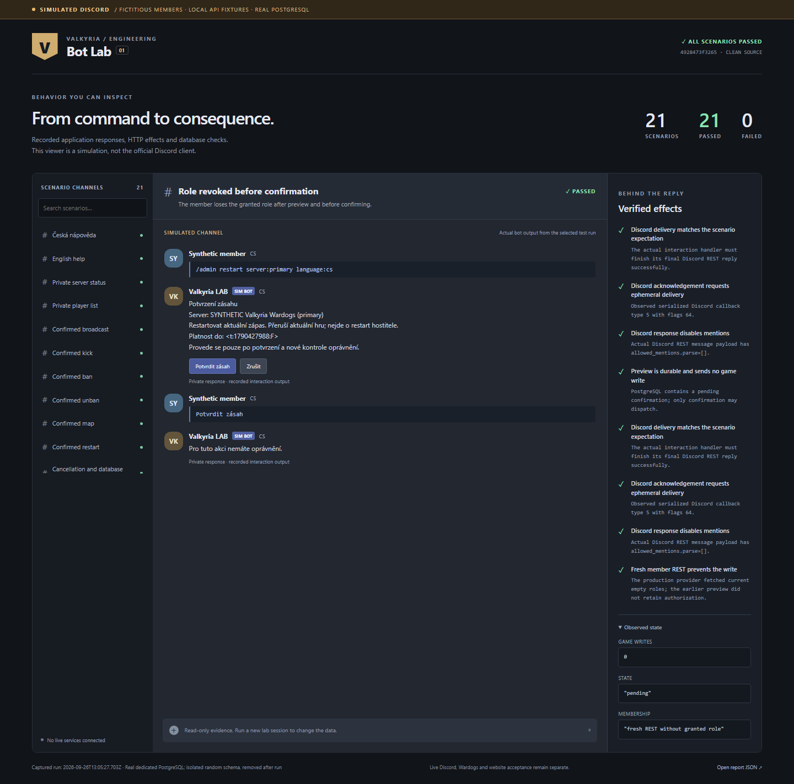
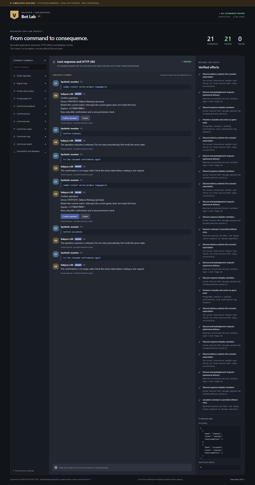
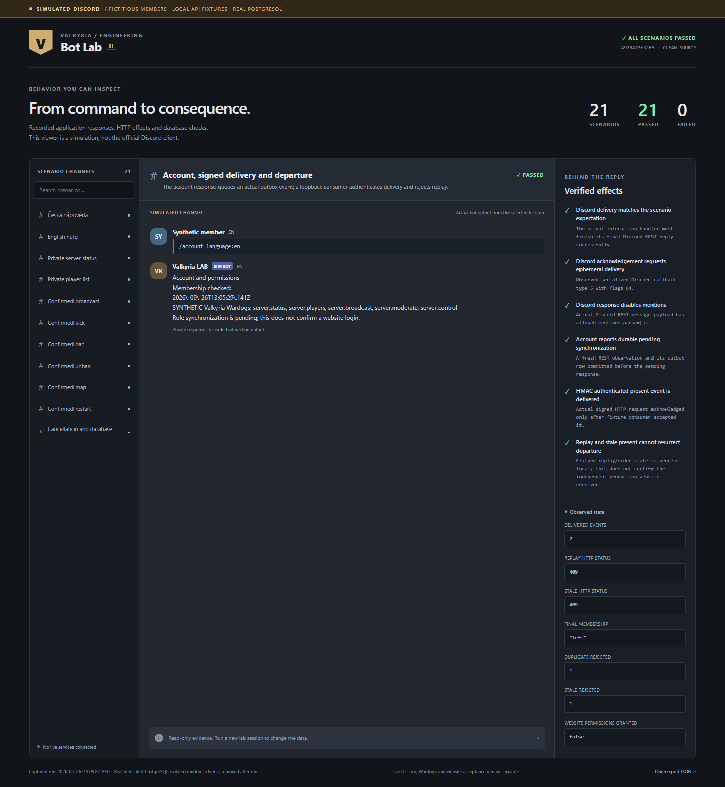
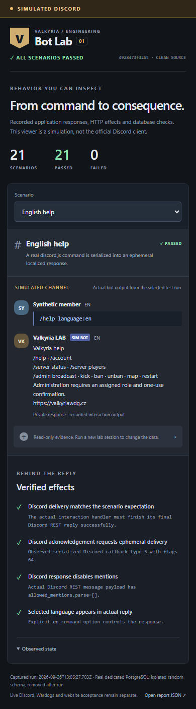

# Simulated Discord evidence

**Synthetic Discord lab — local viewer, not Discord.** These are actual browser
screenshots of recorded production-handler responses and verified local effects.
All actors, memberships, servers and external API responses are fictional. PostgreSQL
and HTTP transport are real. The images are unedited and require no redactions.

Captured on **2026-09-26 at 13:05 UTC / 15:05 Europe/Prague**, using Windows,
Node 24.21.0, pnpm 10.33.0, PostgreSQL 18.4 and Chromium 153.0.8010.12.
The tested source and viewer were the same clean commit:
[`4928473f32657bb5a54cda5b9dc81d3ea4eb6f69`](https://github.com/ValkyriaWDG/bot/commit/4928473f32657bb5a54cda5b9dc81d3ea4eb6f69).
This gallery is committed afterward as documentation proof; it does not claim that
later code was tested. Current CI reports its own revision and environment.

The [report](report.json) contains **21 passed scenarios, zero failed**. The
[manifest](manifest.json) records captions, viewports, exact browser, capture method
and SHA-256 hashes. `pnpm check:evidence` checks consistency; it does not replace
visual inspection, behavioral tests or current CI. Use the [lab guide](../testing-lab.md)
to reproduce the run and the [documentation index](../index.md) to find operator guides.

## Server status

Synthetic Discord lab — local viewer, not Discord. English `/server status` traversed
fresh membership REST and the Wardogs HTTP adapter; the fixture returned two players.
The recorded response requests ephemeral delivery and disables mentions. This proves
serialized intent, not Discord's real privacy behavior. Viewport: 1440 × 1000.

## Confirmed match restart

Synthetic Discord lab — local viewer, not Discord. Czech `/admin restart` saved a
confirmation, rechecked authorization and sent exactly one `POST /v1/match/restart`.
PostgreSQL recorded the accepted result and audit. The response asks the operator to
verify the game effect; the fixture cannot prove an actual game restart. Viewport: 1440 × 1100.

## Role removed before confirmation

Synthetic Discord lab — local viewer, not Discord. After preview, the synthetic member
lost the required role. Fresh REST authorization rejected confirmation and no game write
occurred. Viewport: 1440 × 1100.

## Unknown outcome and replay denial

Synthetic Discord lab — local viewer, not Discord. A missing response and HTTP 202
both produced persisted `unknown` outcomes. The original confirmation could not send
another request. The full-page capture preserves both stories and their checks;
its PNG is taller than the 1440 × 1100 viewport.

## Account and signed membership delivery

Synthetic Discord lab — local viewer, not Discord. `/account` queued a durable role
observation. A local consumer verified HMAC and accepted membership then departure;
replay and an older observation received HTTP 409. This consumer uses process-local
replay state and does not certify the separately developed website. Viewport: 1440 × 1100.

## English help on mobile

Synthetic Discord lab — local viewer, not Discord. `/help language:en` shows the actual
English response. Playwright checked the mobile layout for horizontal overflow and
captured the complete page at a 390 × 844 viewport. This is a responsive lab viewer,
not the official Discord mobile application.

## Verification boundary

The local run passed 142 unit/transport/CLI/runtime tests, seven real PostgreSQL tests,
two E2E tests and three Chromium tests. E2E includes a deliberately rejected normal
Discord reply: the scenario must fail under that fault, preventing false-green proof.
No live login, command registration, game-server action, website integration or image
publication was performed. Those gates remain in [live acceptance](../live-acceptance.md).

Related delivery: [PR #8](https://github.com/ValkyriaWDG/bot/pull/8) and
[simulation acceptance #9](https://github.com/ValkyriaWDG/bot/issues/9). Their current
CI evidence is separate from this dated gallery. CI artifacts expire after 14 days;
this committed report, manifest and selected screenshots remain reviewable.
