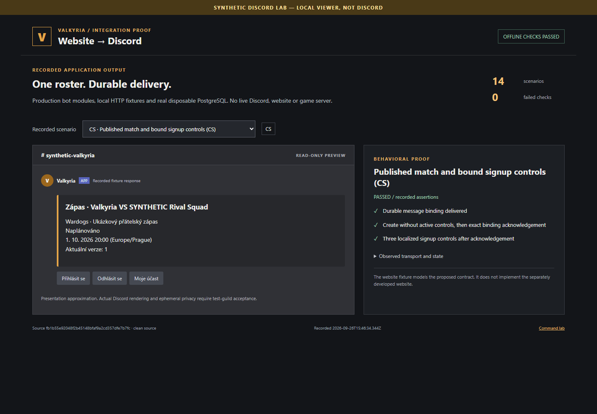
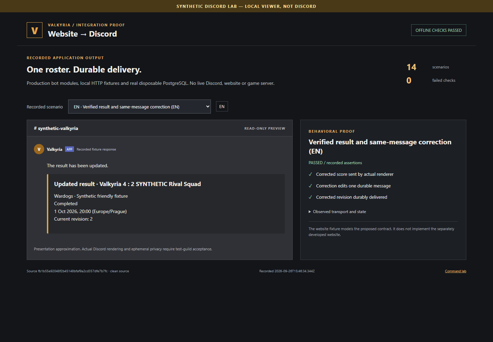
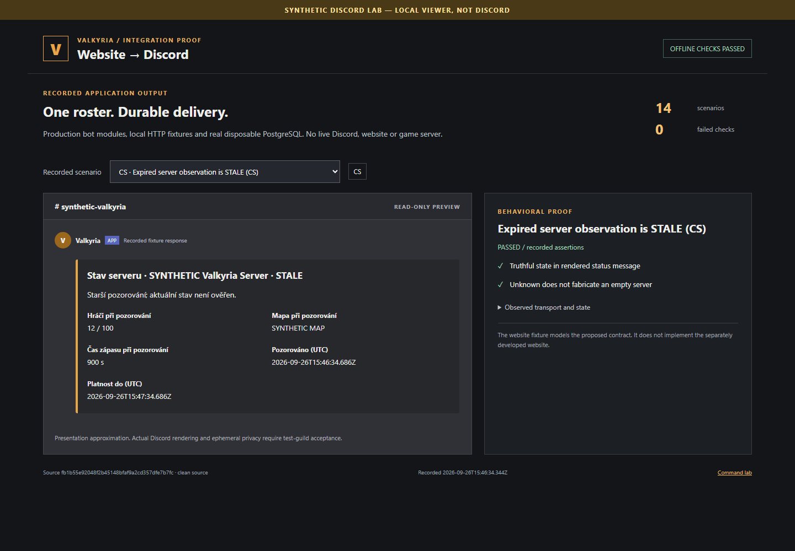
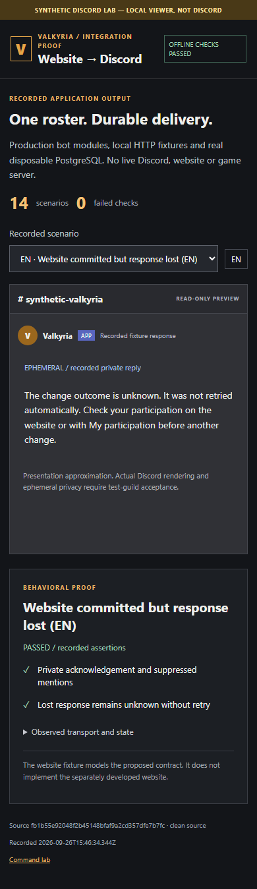
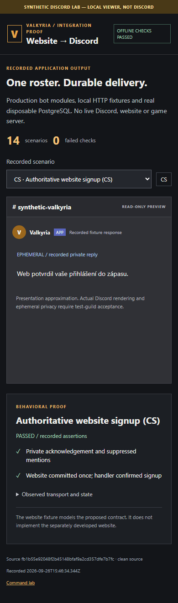

# Website extension evidence — 2026-09-26

**Synthetic Discord lab — local viewer, not Discord.** These are actual Chromium
screenshots of recorded production bot outputs. They do not prove live Discord
rendering, ephemeral privacy, deployed website compatibility or game-server state.

Source and viewer were clean at
`fb1b55e92048f2b45148bfaf9a2cd357dfe7b7fc`. The separate evidence commit contains
this report, manifest and five inspected images. [The manifest](manifest.json)
records UTC capture time, viewport, Chromium/platform and SHA-256 hashes.
[The report](report.json) contains 14 passing scenarios with per-check observations
and serialized local HTTP outputs. No real accounts, bot tokens or infrastructure
addresses are included. Fixture IDs and matches are fictional.

Reproduction: [extension testing](../../testing-extensions.md).
`pnpm check:extensions-evidence` verifies provenance/hashes and passing scenarios;
current CI regenerates its own evidence for the tested revision. The stale scenario
advances an injected fixture clock past expiry; its simulation observation/validity
timestamps and the real screenshot capture clock are intentionally separate.

| Capture                                       | What the recorded result proves                                                                                                                        |
| --------------------------------------------- | ------------------------------------------------------------------------------------------------------------------------------------------------------ |
| [CS match](01-match-cs.png)                   | The bot creates a match message without active signup controls, saves its ID, verifies the website binding, then enables the three localized controls. |
| [EN corrected result](02-result-en.png)       | The verified correction updates the existing result message, score and explicit update label.                                                          |
| [CS stale status](03-stale-status-cs.png)     | Expired observations show STALE with observation/expiry times; the bot does not fabricate OFFLINE or zero players.                                     |
| [EN unknown signup](04-signup-unknown-en.png) | A committed fixture write with a lost response remains UNKNOWN at the bot; no automatic mutation retry occurs.                                         |
| [CS joined signup](05-signup-joined-cs.png)   | The actual private handler reports the canonical fixture's committed signup outcome.                                                                   |

The management API has backend-only HTTP/database/runtime evidence in its integration
tests; the companion web-admin UI does not exist in this repository. Screenshot N/A
for that backend scope is deliberate. [The web handoff](../../handoffs/website-extensions.md)
defines real web/UI and live-guild acceptance still required before closing the issues.
